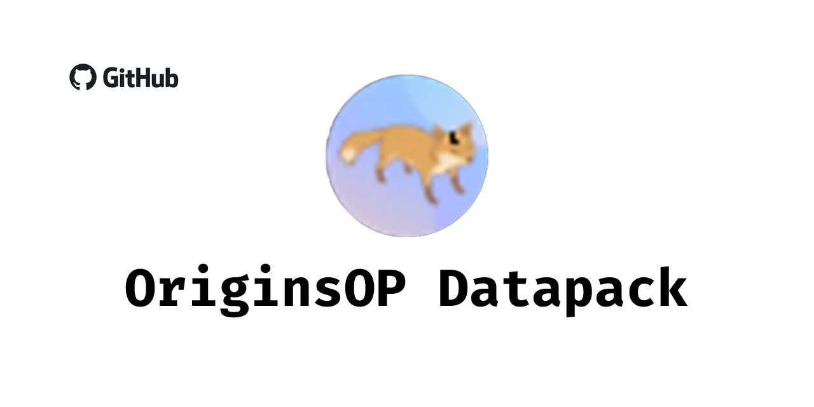

# OriginsOP
This is just a place to back it up.

This datapack was originally (and mostly is) a place to give buffs to the slightly underpowered origins and removes them from the select screen. It uses the namespace `additional` as an ID.

If you want to keep them, change the value `unchooseable` in the files in `data > origins > origins` to false.

In case you haven't noticed, this requires:
* [Origins](https://www.curseforge.com/minecraft/mc-mods/origins)
* [Pehkui](https://www.curseforge.com/minecraft/mc-mods/pehkui)
